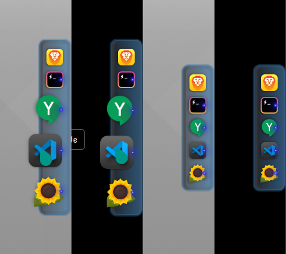

# GunMetal - Plank Dock Theme

<a class="twitter-share-button"
  href="https://twitter.com/share?ref_src=twsrc%5Etfw&text='GunMetal+-+Plank+Theme+'+-+Simple+Plank+Dock+theme%0A%23Linux+%23theme+via+%40thefluxapex"></a> this project.

Just a little Gun Metal Blue &amp; Gray theme for the Plank dock.

## Disclaimer

This is not my application, just my basic little theme

## Plank Dock

Plank is a minimalistic, but somewhat themable *Linux* dock.

Install in Debian APT based systems:

```Bash
sudo apt-get update
sudo apt-get install plank
```

## Theme File

Find the file here or in the "Releases".

|Name|Link|
|:---:|:---:|
|gunmetal.tar.gz|[./src/gunmetal.tar.gz](./src/gunmetal.tar.gz)|

## Install

You can use any file archiver to open and extract the **gunmetal** folder to:

```
~/.local/share/plank/themes/
```

or from the commmand line:

```Bash
tar xvf gunmetal.tar.gz -C ~/.local/share/plank/themes/
```

## Screen Shot


